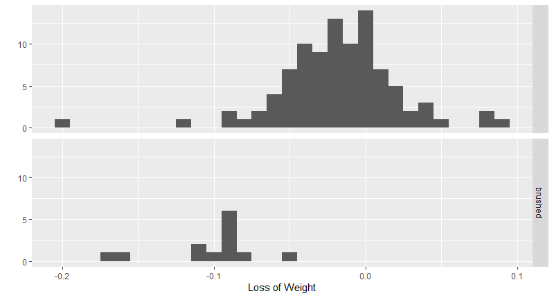
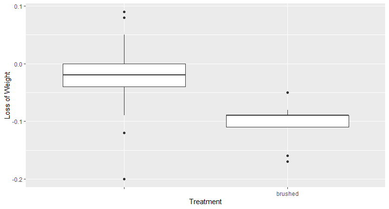

# Coffee Statisics

This project aims to analyze the mass of coffee lost during the grinding process.

This project aims to analyze the mass of coffee lost during the grinding process.

### Data Summary

- Before Bean Weight
- After Grind Bean Weight
- Coffee Type
    - 8 different bags
- Treatment to grinder (brushed before & after; not brushed before and after)
  - Brushed: n = 13
  - Not Brushed: n = 95

  

  
  

  

  
  

The coffee beans were neither randomly sampled nor randomly assigned to treatment groups (in this case, cleaning the grinder before & after) -- thus, we cannot draw any inferences about population nor any causal inferences. Provided the three assumptions for a t-test and t-confidence interval, that we have normally distributed populations, two populations with approximately the same variation, and that observations are independent, we will perform a one-sided two-sample t-test.

### Results:
There is very strong evidence (`p ~ 4.443e-11`) that the mean “brushed” loss of weight before & after grinding is greater than the mean “un-brushed” loss of weight before & after grinding.

`Two Sample t-test`

`data:  Difference by Notes`
`t = 7.2043, df = 106, p-value = 4.443e-11`
`alternative hypothesis: true difference in means is greater than 0`
`95 percent confidence interval:`
 `0.06445915        Inf`
`sample estimates:`
       `mean in group  mean in group brushed`
          `-0.01778947           -0.10153846`

### Further Suggestions:

It would be helpful to randomly assign the grinder treatment.
More data with the “brushed” treatment would be helpful.
Performing a different analysis and seeing how a treatment like “grind time” can affect the loss of weight before & after grinding. We can then randomly assign the beans to groups of grind time.